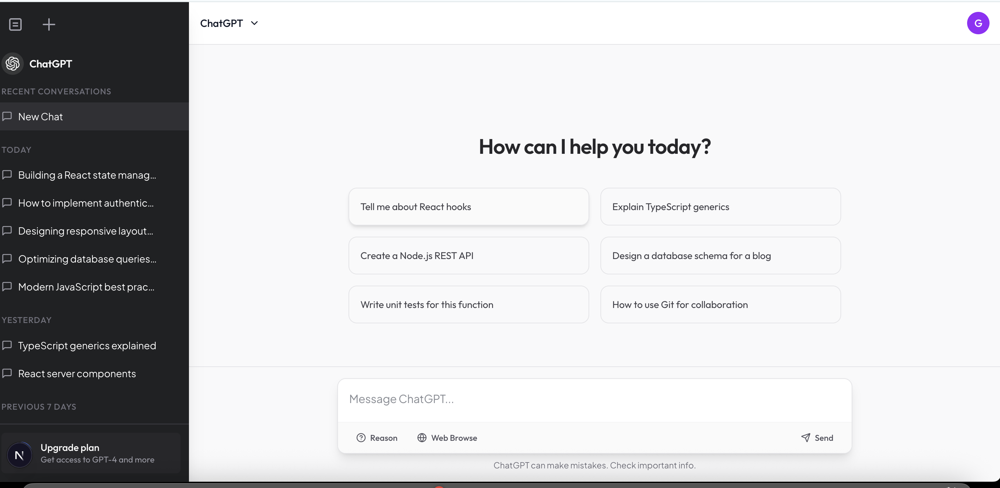

# 🧠 ChatGPT Clone

A sleek and responsive ChatGPT clone built with **Next.js**, **TypeScript**, and **Tailwind CSS** — deployed on **Vercel** for seamless performance.

## 🚀 Live Demo

👉 [View Live on Vercel](https://vercel.com/mikes-projects-39d4e706/chat-gpt-clone)

## 📸 Preview

  

---

## 🛠️ Tech Stack

- **Frontend**: [Next.js](https://nextjs.org/), [TypeScript](https://www.typescriptlang.org/), [Tailwind CSS](https://tailwindcss.com/)
- **Deployment**: [Vercel](https://vercel.com/)

---

## 🔑 Features

- Chat interface inspired by ChatGPT
- Responsive design for mobile and desktop
- Typing indicator

